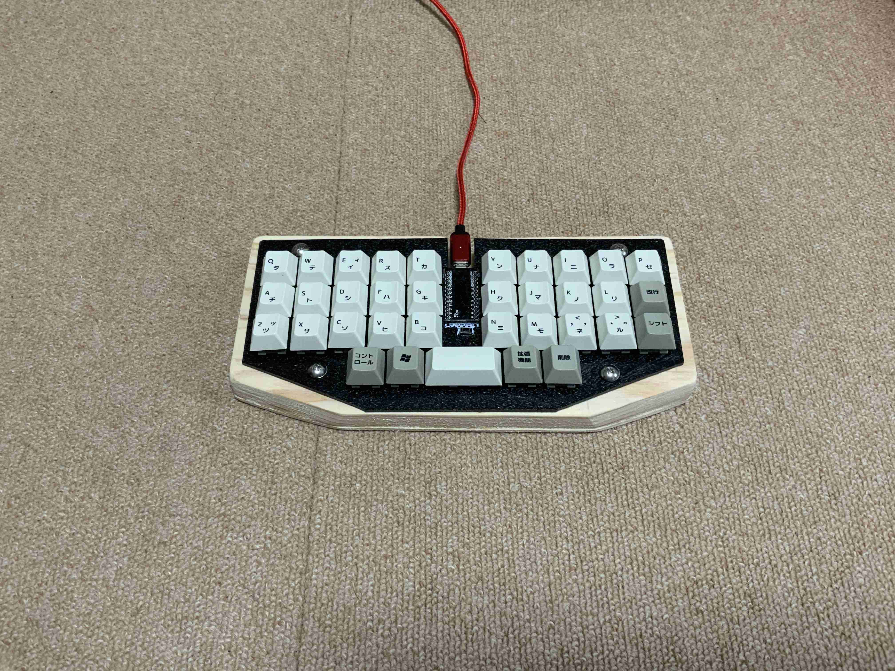
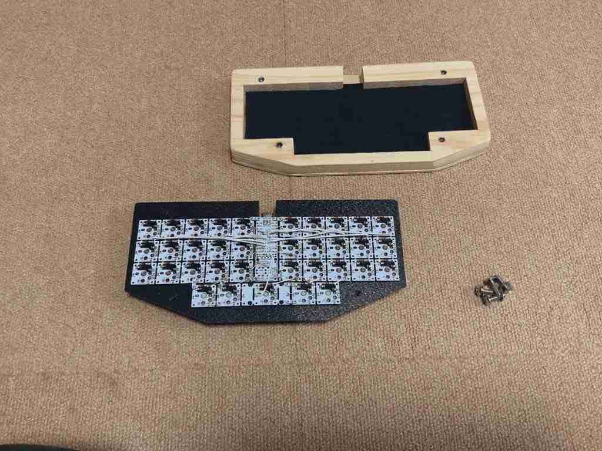
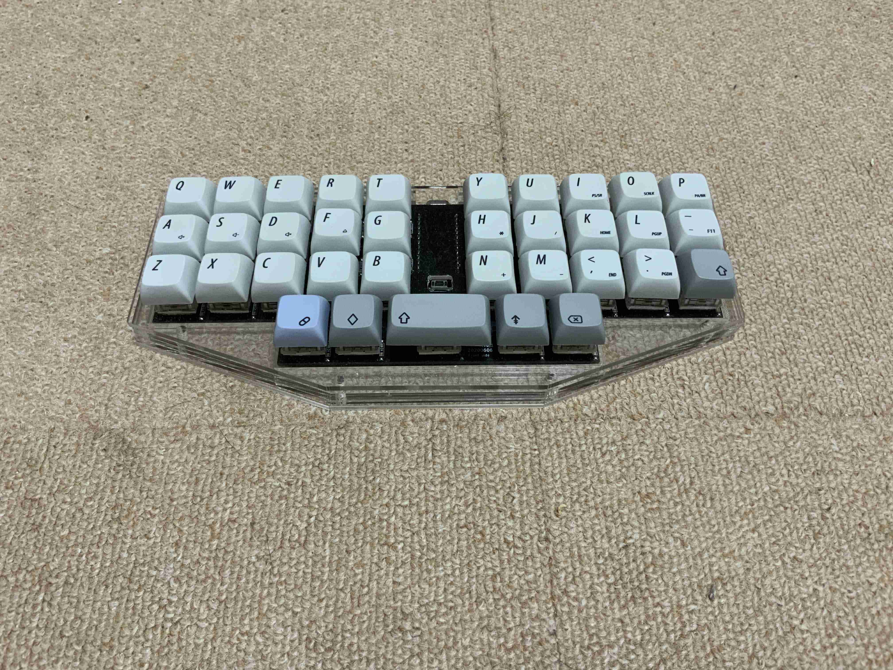
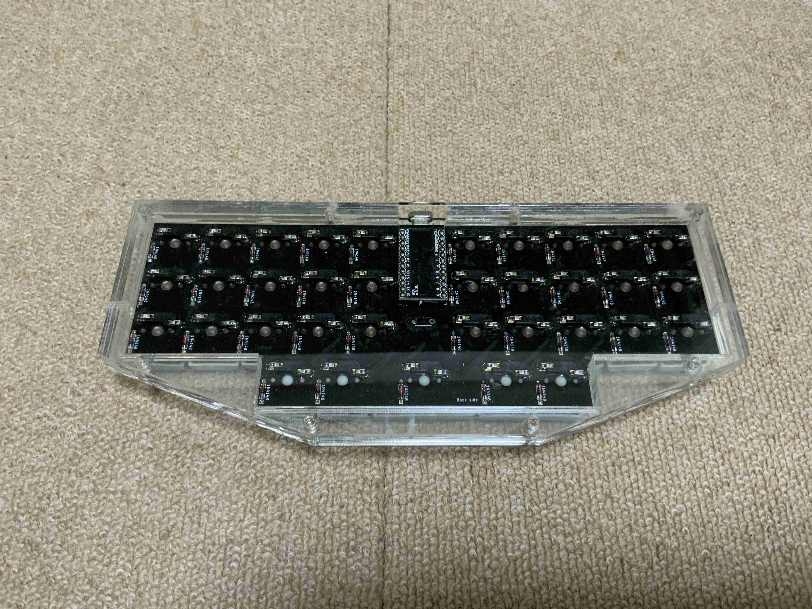
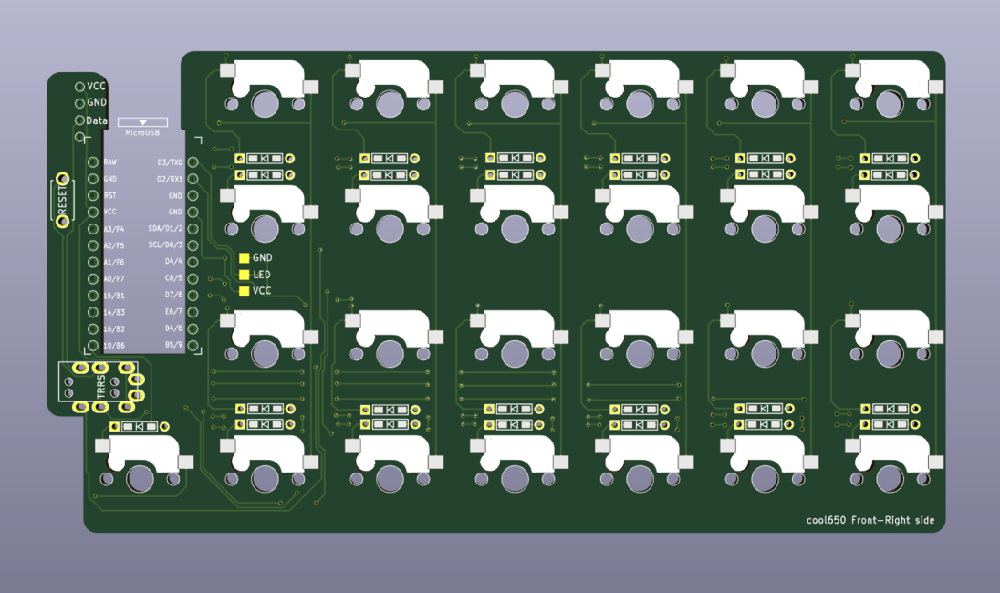
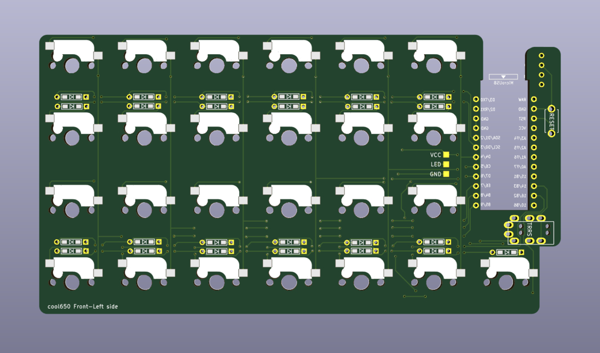
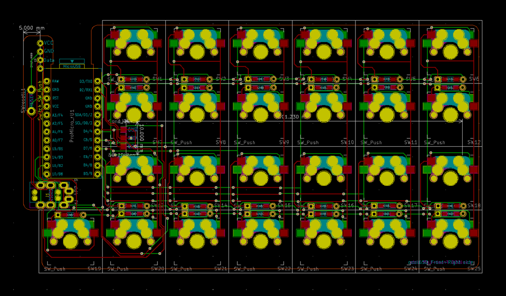

# cool650

 

## What is a cool650?

cool650 is macro pad keyboard,
 
and splite keyboard.
 
 
cool650は、cool635と同じ格子配列のキーボードです。
 
cool635は、m.kiが設計した、とてもコンパクトな30％キーボードです。
635とは、開発番号は６で、35キーのキーボードを指しています。
 

cool635 SU120で製作した試作版

分解したcool635

cool635 kicadでPCBを設計した完成版

裏側から見たcool635

cool635の完成版はアクリル積層ケースによって、埃などが侵入しにくいです。
 
しかし、m.kiは、ロウスタッガードのキーレイアウトが好みであったため、あまり使うことなく、お蔵入りしました。
 
 
cool650は、ALLPCBが100mmx150mm以下のPCB製作無料キャンペーンを利用して、設計しました。

ご覧の通り、表裏で使えるようになっています。一つで25キーあり、マクロパッドとして利用できます。二つをTRRSケーブルで繋ぐことにより、格子配列の分割キーボードとしても利用できます。
 
ケースはアクリル2mmを使用して、積層したものです。
配線関係の詳細は検討中ですが、60％のPoker互換のキーボードケースには、二つ分が収まります。
汎用ケースに収めることで50キーの格子配列のキーボード、取り出して、分割キーボード、単体で25キーのマクロパッドになることが、cool650のコンセプトです。